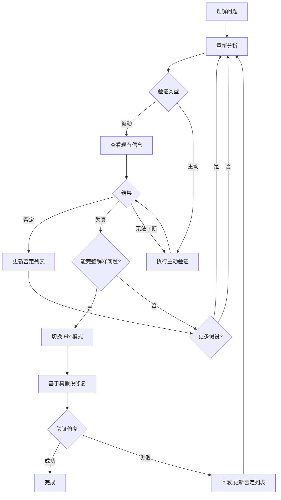

# 代码调试

**开始时声明:** "我正在使用 code-debug 技能进行结构化调试。"

## 模式

### Debug-Only 模式
1. 不修改业务逻辑代码
2. 不给出"可能的修复方案"
3. 只提出可验证的假设
4. 允许添加临时调试代码（日志、测试脚本等），验证后必须移除

### Fix 模式
1. 只基于"已验证为真的假设"修改代码
2. 每处修改必须映射到对应假设
3. 失败时回滚并更新已否定假设清单

## 验证类型

| 类型 | 说明 | 手段 |
|------|------|------|
| **被动验证** | 现有信息足够判断 | 查看代码、日志、错误堆栈、配置、文档 |
| **主动验证** | 需要主动获取数据 | 添加临时日志、编写测试脚本、使用调试工具、询问用户、修改输入测试、检查网络请求、数据库查询 |

## 假设状态

- **待验证** — 尚未验证
- **已验证为真** — 有明确证据支持
- **已否定** — 有明确证据否定
- **无法判断** — 需要更深入的验证

## 流程图



## 过程

### 1. 理解问题

```
## 问题定义

### 现象
[实际观察到的bug]

### 复现步骤
1. [步骤1]
2. [步骤2]

### 预期行为
[预期的正确行为]

### 错误信息
[完整错误/日志]

### 涉及代码
- `path/to/file.js:123` - [说明]
```

### 2. 生成假设

```
## 假设列表

### H1: [假设标题]
**现象解释:** [如何解释当前问题]
**预测结果:** [如果为真会观察到什么]
**验证类型:** [被动|主动]
**验证方法:** [具体验证步骤]
**若验证失败的结论:** [说明什么]
```

### 3. 验证假设

按优先级验证，被动优先。

```
## 验证记录

### H1 验证
**状态:** [已验证为真|已否定|无法判断]
**执行:** [执行的验证步骤]
**结果:** [实际观察到的结果]
**结论:** [基于结果的结论]
```

**状态为"无法判断"时，执行主动验证手段，重新判断。**

### 4. 已否定假设清单

每次否定后更新：

```
## 已否定假设列表 (Do Not Reuse)

- H1: [假设摘要]
  - 否定依据: [具体证据]
```

**规则：** 任何新假设必须说明"为什么不在已否定假设列表中"。

### 5. 模式切换

**切换条件：**
- 至少有一个假设已验证为真
- 所有真假设合起来能完整解释bug现象

```
## 模式切换: Debug-Only → Fix

已验证假设:
- H[X]: [假设摘要] - [证据]

完整问题解释:
[说明这些假设如何解释所有现象]
```

### 6. 执行修复

```
## 修复方案

### 修改 1
**基于假设:** H[X]
**文件:** `path/to/file.js:123`
**修改前/后:** [代码]
**理由:** [如何解决问题]

### 验证修复
**执行:** [验证步骤]
**结果:** [成功/失败]
```

## 证据约束

**判断必须引用：**
- 具体代码行
- 实际报错信息
- 运行时日志
- 测试脚本结果
- 用户回答

**禁止：**
- "可能是因为..."
- "试试改这里"
- 无依据推测
