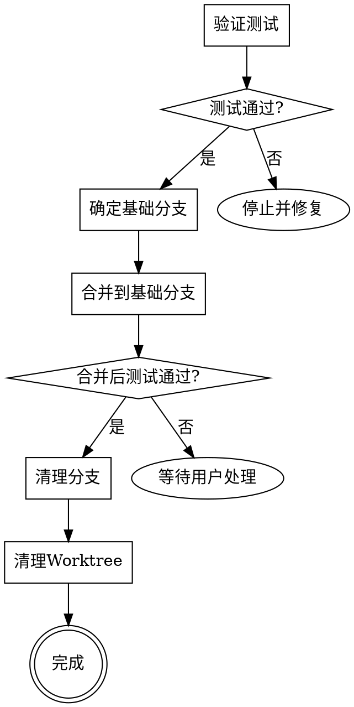

# 完成开发分支（Finishing a Development Branch）

## 概述

验证测试通过后，将feature分支合并到其创建的基础分支。

**核心原则：** 验证测试 → 确定基础分支 → 合并 → 清理。

**开始时声明：** "我正在使用 finishing-a-development-branch skill 来完成这项工作。"

## 流程

### 步骤 1：验证测试

**在合并之前，验证所有测试通过：**

```bash
# 运行项目的测试套件
npm test / cargo test / pytest / go test ./...
```

**如果测试失败：**
```
测试失败（<N> 个失败）。必须在合并前修复：

[显示失败内容]

在测试通过之前无法继续进行合并。
```

停止。不要继续到步骤 2。

**如果测试通过：** 继续到步骤 2。

### 步骤 2：确定基础分支

确定当前feature分支从哪个分支分出：

```bash
# 方法1：获取当前分支名
current_branch=$(git rev-parse --abbrev-ref HEAD)

# 方法2：查找基础分支
git merge-base HEAD main 2>/dev/null && echo "main" || git merge-base HEAD master 2>/dev/null && echo "master"
```

或者询问："这个分支从 <branch-name> 分出 - 这是否正确？"

### 步骤 3：合并到基础分支

```bash
# 切换到基础分支
git checkout <base-branch>

# 拉取最新内容（如果有远程）
git pull origin <base-branch>

# 合并feature分支
git merge <feature-branch>

# 在合并结果上验证测试
npm test / cargo test / pytest / go test ./...
```

**如果合并后测试失败：**
- 报告冲突或失败情况
- 等待用户处理

**如果合并后测试通过：** 继续到步骤 4。

### 步骤 4：清理分支

```bash
# 删除已合并的feature分支
git branch -d <feature-branch>
```

### 步骤 5：清理 Worktree（如适用）

检查是否在worktree中：
```bash
git worktree list | grep $(pwd)
```

如果在worktree中：
```bash
git worktree remove <worktree-path>
```

**完成报告：**
"已完成实现，测试通过，已合并到 <base-branch>，分支已清理。"

## 流程图



## 快速参考

| 步骤 | 命令 | 验证 |
|------|------|------|
| 1. 验证测试 | `npm test` 等 | ✅ 测试必须通过 |
| 2. 确定基础分支 | `git merge-base` | ✅ 确认基础分支 |
| 3. 合并 | `git merge` | ✅ 合并后测试通过 |
| 4. 清理分支 | `git branch -d` | - |
| 5. 清理Worktree | `git worktree remove` | - |

## 常见错误

**跳过测试验证**
- **问题：** 合并损坏的代码
- **修复：** 在合并前总是验证测试

**合并后不验证测试**
- **问题：** 合并引入的冲突或破坏未被检测到
- **修复：** 合并后必须再次运行测试

**错误的基础分支**
- **问题：** 合并到错误的分支导致代码混乱
- **修复：** 使用 `git merge-base` 确认正确的基础分支

**不清理worktree**
- **问题：** 留下无用的worktree占用空间
- **修复：** 完成后检查并清理worktree

## 红旗警告

**永远不要：**
- 在测试失败的情况下继续合并
- 在合并后不验证测试
- 不确认基础分支就合并
- 在没有备份的情况下删除未合并的分支

**总是：**
- 在合并前验证测试
- 在合并后再次验证测试
- 确认正确的基础分支
- 清理已合并的分支和worktree

## 工作流程说明

此技能在以下工作流程中使用：

1. **brainstorming** - 创建 feature 分支
2. **writing-plans** - 编写实施计划
3. **executing-plans** - 执行计划，完成后自动合并（内置此流程）
4. **code-quality-review** - 代码质量审查（推荐）
5. **finishing-a-development-branch** - 合并到基础分支

当使用 **executing-plans** 时，完成流程已内置在步骤5中，不需要单独调用此技能。

**推荐流程：**
- 在 **code-quality-review** 之后调用此技能
- 代码质量审查完成且问题已处理后，调用此技能进行合并

此技能用于以下场景：
- 手动执行计划完成后
- 代码质量审查完成后
- 需要在执行计划流程之外进行合并时
- 需要单独验证并合并现有 feature 分支时
