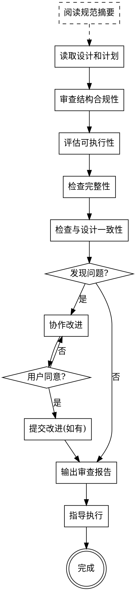

# 审查实施计划 (Reviewing Plans)

## 概述

通过自然的协作对话，审查实施计划的可行性和完整性，确保计划符合 writing-plans 标准并包含所有必要信息。

**开始时声明:** "我正在使用 reviewing-plans 技能来审查实施计划。"

**上下文:** 这应该在新的独立会话中运行，在 writing-plans 创建计划之后。

**触发命令:** `/check-plan docs/plans/YYYY-MM-DD-<topic>-design.md docs/plans/YYYY-MM-DD-<topic>-plan.md`

---

## writing-plans 规范摘要

本审查基于 writing-plans 标准进行。计划必须满足以下核心规范：

### 核心原则
1. **DRY（Don't Repeat Yourself）** — 不重复代码，抽取可复用逻辑
2. **YAGNI（You Aren't Gonna Need It）** — 不包含未来可能需要但现在不需要的功能
3. **TDD（Test-Driven Development）** — 先写测试，后写实现，测试必须先失败再通过
4. **频繁提交** — 每个任务完成后提交一次

### 计划文档结构

```markdown
# [功能名称] 实施计划

> **给 Claude:** 必需子技能:使用 superpowers:executing-plans 逐任务实施此计划。

**目标:** [一句话描述这个计划构建什么]

**架构:** [2-3句话描述方法]

**技术栈:** [关键技术/库]

---

### 任务 N: [组件名称]

**文件:**
- 创建: `exact/path/to/file.py`
- 修改: `exact/path/to/existing.py:123-145`
- 测试: `tests/exact/path/to/test.py`

**步骤 1: 编写失败的测试**

[完整测试代码]

**步骤 2: 运行测试以验证失败**

运行: `pytest tests/path/test.py::test_name -v`
预期: FAIL,显示具体错误信息

**步骤 3: 编写最小实现**

[完整实现代码]

**步骤 4: 运行测试以验证通过**

运行: `pytest tests/path/test.py::test_name -v`
预期: PASS

**步骤 5: 提交**

```bash
git add tests/path/test.py src/path/file.py
git commit -m "feat: add specific feature"
```
```

### 必须满足的要求

| 要求 | 说明 |
|------|------|
| **完整代码** | 所有代码必须完整，不可用伪代码或占位符 |
| **精确路径** | 文件路径必须精确，修改文件包含行号范围 |
| **步骤粒度** | 每个步骤2-5分钟可完成，只做一件事 |
| **TDD流程** | 测试→运行失败→实现→运行通过→提交 |
| **明确预期** | 每个步骤都有清晰的预期输出和验证标准 |

---

## 审查清单创建

你必须将以下的步骤加入到你的任务清单中并按顺序完成：

**审查前准备:**
1. **阅读 writing-plans 规范摘要** — 理解必须遵循的标准要求（见上方章节）

**审查过程:**
1. **读取设计和计划文件** — 理解需求和实施策略
2. **审查计划结构合规性** — 对照规范摘要检查头部、任务结构、步骤粒度、TDD流程等
3. **评估可执行性** — 验证每个步骤是否可以实际执行（文件路径、命令、依赖关系）
4. **检查完整性** — 确认是否包含所有必要信息（技术细节、验证标准、遗漏项）
5. **检查与设计一致性** — 验证计划是否符合设计文档的要求
6. **识别问题** — 找出缺失、不明确或不一致的部分
7. **协作改进** — 通过对话方式完善计划
8. **输出审查报告** — 提供审查结果和实现思路
9. **完成审查** — 提交改进（如有）并指导用户执行计划

## 流程图



## 审查维度

### 1. 计划结构合规性

**必须包含的头部信息（遵循 writing-plans 标准）:**
- [ ] 功能名称（格式: `# [功能名称] 实施计划`）
- [ ] 必需子技能声明（格式: `> **给 Claude:** 必需子技能:使用 superpowers:executing-plans 逐任务实施此计划。`）
- [ ] 目标（格式: `**目标:** [一句话描述这个计划构建什么]`）
- [ ] 架构（格式: `**架构:** [2-3句话描述方法]`）
- [ ] 技术栈（格式: `**技术栈:** [关键技术/库]`）
- [ ] 分隔线（头部末尾必须有 `---`）

**任务结构要求:**
- [ ] 每个任务标题格式: `### 任务 N: [组件名称]`
- [ ] 每个任务必须有 **文件** 段落，明确列出:
  - `创建: exact/path/to/file.py` （新文件完整路径）
  - `修改: exact/path/to/existing.py:123-145` （现有文件+行号范围）
  - `测试: tests/exact/path/to/test.py` （测试文件路径）
- [ ] 每个步骤格式: `**步骤 N: [简短描述]**` （如: 编写失败的测试、运行测试验证失败、编写最小实现等）
- [ ] 每个步骤必须包含完整代码（可直接复制运行）
- [ ] 测试步骤必须包含精确的命令和预期输出（格式: `运行: pytest ... 预期: PASS/FAIL`）
- [ ] 每个任务必须以提交步骤结束（格式: `**步骤 N: 提交`` + git命令）

**步骤粒度要求:**
- [ ] 每个步骤对应2-5分钟可完成的单个动作
- [ ] 一个步骤只做一件事（测试 OR 实现代码 OR 运行测试 OR 提交）
- [ ] 禁止合并步骤（如: "编写测试并运行"必须拆分为两个步骤）

**代码完整性要求:**
- [ ] 所有代码必须完整展示，不可用伪代码或占位符
- [ ] 不可写"添加验证"、"实现功能"等抽象描述
- [ ] 必须写出完整的函数、类、测试用例代码
- [ ] 导入语句必须完整列出

**TDD流程要求（每个任务必须遵循）:**
- [ ] 步骤1: 编写失败的测试
- [ ] 步骤2: 运行测试以验证失败
- [ ] 步骤3: 编写最小实现
- [ ] 步骤4: 运行测试以验证通过
- [ ] 步骤5: 提交

**DRY/YAGNI/TDD/频繁提交要求:**
- [ ] 计划中不应重复相同的代码块（DRY）
- [ ] 相似的逻辑应抽取为可复用函数（DRY）
- [ ] 计划中不应包含未来可能需要但现在不需要的功能（YAGNI）
- [ ] 每个步骤都应直接服务于当前目标（YAGNI）
- [ ] 必须先写测试，后写实现代码（TDD）
- [ ] 测试必须先失败，再写代码使其通过（TDD）
- [ ] 不允许"边写代码边写测试"或"写完代码后补测试"（TDD）
- [ ] 每个任务完成后必须提交一次（频繁提交）
- [ ] 不允许多个任务合并为一次提交（频繁提交）

### 2. 可执行性检查

**文件路径有效性:**
- [ ] 路径格式正确（使用 `exact/path/to/file.py` 格式，不能用相对路径）
- [ ] 修改文件必须包含行号范围（如 `existing.py:123-145`），不能只写文件名
- [ ] 测试文件路径必须准确反映项目结构（如 `tests/unit/path/to/test.py`）
- [ ] 所有路径必须以项目根目录开头（不能写 `../file.py`）

**步骤可执行性:**
- [ ] 每个步骤可以独立完成（不需要依赖上下文信息）
- [ ] 包含完整代码（可直接复制运行，无需额外修改）
- [ ] 测试步骤有具体的断言和预期结果（如 `assert result == expected`）
- [ ] 命令可以直接复制执行（如 `pytest tests/path/test.py::test_name -v`）
- [ ] 预期输出必须明确说明（如 `预期: FAIL,显示 "function not defined"`）

**依赖关系清晰:**
- [ ] 任务顺序合理，依赖关系明确（任务A引用任务B的代码时，任务B必须在前面）
- [ ] 没有循环依赖（任务A依赖任务B，任务B又依赖任务A）
- [ ] 没有未定义的引用（代码中使用的函数、类必须在计划中有定义或导入步骤）
- [ ] 每个提交都有明确的提交信息（遵循约定式提交: `feat:`, `fix:`, `docs:`, `test:` 等）

**命令可验证性:**
- [ ] 测试命令可执行（如 `pytest`, `npm test`, `cargo test` 等）
- [ ] 构建命令可执行（如 `npm run build`, `mvn compile` 等）
- [ ] 安装依赖命令明确（如 `npm install package-name`, `pip install package`）
- [ ] 所有命令都不需要用户手动输入或交互

### 3. 完整性检查

**技术细节完整性:**
- [ ] 实现代码完整（非伪代码，可直接运行）
- [ ] 测试代码完整（包含具体的输入值和断言语句）
- [ ] 错误处理方案明确（try-catch、错误码、异常等）
- [ ] 边界条件已考虑（空值、空数组、最大值、最小值等）
- [ ] 导入语句完整（所有使用的库和模块都已列出）

**验证标准完整性:**
- [ ] 每个测试步骤有明确的预期输出（PASS/FAIL + 具体错误信息）
- [ ] 包含完整的测试命令（包括文件路径、测试函数名、参数等）
- [ ] 成功/失败标准清晰（如"预期: PASS" 或 "预期: FAIL,显示具体错误消息"）
- [ ] 运行命令的输出有具体说明（不只是"测试通过"）

**遗漏检查（对照设计文档）:**
- [ ] 设计中提到的所有组件/模块都已覆盖
- [ ] 数据流和状态变化完整（从输入到输出的完整链路）
- [ ] 错误处理和边界情况已包含（设计文档中提到的错误场景）
- [ ] 必要的配置/设置步骤已添加（环境变量、配置文件、数据库初始化等）
- [ ] 依赖包安装步骤已包含（package.json, requirements.txt等）
- [ ] 数据库迁移或表结构创建步骤已包含（如适用）

**接口定义完整性:**
- [ ] API端点完整（URL、方法、参数、返回值）
- [ ] 函数签名完整（参数类型、返回类型）
- [ ] 类的接口完整（方法、属性）
- [ ] 数据模型完整（字段、类型、约束）

**环境配置完整性:**
- [ ] 开发环境配置（本地运行需要的环境变量、配置文件）
- [ ] 依赖安装（npm install, pip install等命令）
- [ ] 数据库设置（初始化脚本、迁移命令）
- [ ] 必要的工具或CLI已安装（如docker、特定CLI工具等）

### 4. 与设计的一致性

**需求覆盖完整性:**
- [ ] 设计文档中提到的所有功能特性都在计划中体现
- [ ] 架构决策在实施中正确反映（如选择的架构模式、设计原则）
- [ ] 技术栈选择与设计一致（如语言、框架、库的版本）
- [ ] 设计中的约束条件在计划中遵循（如性能要求、安全要求）

**目标对齐检查:**
- [ ] 实施步骤直接支持设计中的目标（不偏离设计初衷）
- [ ] 没有超出原始需求的额外功能（符合YAGNI原则）
- [ ] 成功标准与设计预期一致（设计文档中的验收标准在测试中体现）

**技术决策一致性:**
- [ ] 使用的技术与设计文档一致（不擅自更换技术栈）
- [ ] 架构层次划分与设计一致（MVC、分层架构等）
- [ ] 数据流与设计文档描述一致
- [ ] 接口设计与设计文档一致（API设计、函数签名等）

**约束条件遵循:**
- [ ] 设计中提到的性能约束在计划中考虑（如响应时间、吞吐量）
- [ ] 安全要求在计划中体现（如加密、认证、授权）
- [ ] 兼容性要求在计划中满足（如跨浏览器、向后兼容）
- [ ] 可扩展性设计符合设计文档规划

## 协作改进流程

### 识别问题后

**清晰陈述问题，说明原因，提出改进建议**

**示例对话:**

> ❌ 不好的方式:
> "第3个任务有问题，代码不完整。"
>
> ✅ 好的方式:
> "在任务3（创建AuthService）中，步骤3的登录验证代码只返回了固定值。如果用户传入错误的密码，代码会返回'登录成功'，这不符合预期。我们需要添加实际的密码验证逻辑。你希望使用bcrypt进行密码哈希，还是有其他偏好？"

### 改进类型示例

**缺少信息时:**
> "在步骤2中，代码引用了 `getUserById` 函数，但没有定义这个函数的位置和行为。这应该从哪个文件导入？还是需要在其他任务中先创建这个函数？"

**不明确时:**
> "步骤4提到'验证响应格式'，但没有说明响应的具体格式要求。预期返回JSON还是文本？包含哪些字段？"

**不一致时:**
> "设计中提到使用PostgreSQL数据库，但任务5中的代码使用了MongoDB语法。这里需要统一，你希望调整计划使用MongoDB，还是改用PostgreSQL？"

**不可执行时:**
> "步骤2的命令 `npm run build` 可能会失败，因为package.json中没有定义build脚本。需要添加这个脚本还是使用其他命令？"

### 用户参与策略

**提问策略:**
- 每次只问一个问题
- 优先使用多选题（如"使用A还是B"）
- 解释每个选项的利弊

**确认机制:**
- 每个重要改进后询问是否同意
- 对于小改动可以批量确认
- 关键改动必须单独确认

**示例:**
> "我发现了3个需要改进的地方：
> 1. 任务2缺少错误处理
> 2. 步骤4的测试用例不完整
> 3. 需要添加依赖安装步骤
>
> 我可以逐个讨论这些改进，还是你希望我先一次性展示所有改进建议？"

### 改进时同步更新设计文档

**如果在协作改进过程中，计划发生了与设计文档不一致的变更:**
- 必须同步更新设计文档 `docs/plans/YYYY-MM-DD-<topic>-design.md`
- 确保设计和实施计划保持一致性

## 输出格式

审查完成后，按以下格式输出：

```markdown
# 实施计划审查报告

## ✅ 整体评估

**可行性:** [可执行/需要改进/不可执行]
**完整性:** [完整/部分缺失/严重缺失]
**合规性:** [完全符合/部分符合/不符合]

## 📊 审查结果

### 结构合规性
- ✅/❌ 头部信息完整
- ✅/❌ 任务结构规范
- ✅/❌ 步骤粒度适当

### 可执行性
- ✅/❌ 文件路径有效
- ✅/❌ 步骤可独立执行
- ✅/❌ 依赖关系清晰

### 完整性
- ✅/❌ 技术细节充分
- ✅/❌ 验证标准明确
- ✅/❌ 无重要遗漏

### 与设计一致性
- ✅/❌ 需求覆盖完整
- ✅/❌ 目标对齐
- ✅/❌ 技术栈一致

## 🔍 发现的问题

[列出所有发现的问题，按严重程度排序]

## 💡 改进建议

[提供具体的改进建议]

## ✨ 实现概览

**本计划将按以下步骤实现 [功能名称]:**

1. **基础设施准备** — 安装依赖、创建基础结构 (任务1-2)
2. **核心功能实现** — 实现主要的业务逻辑 (任务3-6)
3. **集成测试** — 编写端到端测试确保功能完整 (任务7-8)
4. **文档和清理** — 添加注释、代码格式化 (任务9)

**关键技术决策:**
- 使用 [框架/库] 原因是...
- 选择 [方案A] 而非 [方案B] 因为...

**测试策略:**
- 单元测试覆盖所有公共方法
- 集成测试验证主要用户流程
- 边界测试处理错误情况

---

[如果发现问题，开始协作改进]
[如果没有问题，继续到"审查完成后的下一步"]
```

## 关键原则

- **逐项审查** — 系统地检查每个审查维度，避免遗漏
- **具体明确** — 指出问题时要具体到哪个任务、哪个步骤
- **协作改进** — 使用对话方式理解用户意图，而非假设
- **用户导向** — 确保用户清楚了解实现思路和技术决策
- **保持规范** — 改进后的计划必须符合 writing-plans 标准
- **可追溯性** — 保留审查历史，方便后续参考

## 常见问题

**Q: 如果计划完全没有问题怎么办?**
A: 确认计划可以执行，输出审查报告，不进行任何修改，直接进入"审查完成后的下一步"。

**Q: 如果发现大量问题怎么办?**
A: 按严重程度排序，先解决阻塞性问题，再逐步改进细节。不要一次性提出所有改进，采用分批次协作方式。

**Q: 用户不同意某个改进建议怎么办?**
A: 尊重用户决定，但记录风险和潜在问题。如果是阻塞性问题，必须达成共识。

**Q: 计划修改很大，是否需要重写?**
A: 如果超过50%需要修改，建议与用户确认是否需要重新调用 writing-plans 技能重新生成计划。

**Q: 改进计划时需要更新设计文档吗?**
A: 如果改进过程中计划发生了与设计文档不一致的变更，必须同步更新设计文档，确保两者保持一致。

## 审查完成后的下一步

### 情况1：计划无需改进，可以直接执行

```
计划审查通过，可以开始实施。

你应该结束本次会话，开启新的会话，并复制以下命令到新的会话窗口：

/execute-plan docs/plans/YYYY-MM-DD-<topic>-plan.md
```

### 情况2：计划已改进，需要提交并执行

**步骤1：提交改进后的计划**

仅更新计划时：
```bash
git add docs/plans/YYYY-MM-DD-<topic>-plan.md
git commit -m "docs: refine implementation plan based on review"
```

同时更新计划和设计文档时：
```bash
git add docs/plans/YYYY-MM-DD-<topic>-plan.md docs/plans/YYYY-MM-DD-<topic>-design.md
git commit -m "docs: refine plan and design based on review"
```

**步骤2：指导用户执行**

```
计划已更新并提交到feature分支。

你应该结束本次会话，开启新的会话，并复制以下命令到新的会话窗口：

/execute-plan docs/plans/YYYY-MM-DD-<topic>-plan.md
```

### 提交说明

- **直接更新原文件**：所有改进都在原 `docs/plans/YYYY-MM-DD-<topic>-plan.md` 文件中进行，不创建新文件
- **同步更新设计**：如果计划改进导致与设计文档不一致，必须同步更新设计文档
- **保持一致性**：确保设计和实施计划保持一致性
